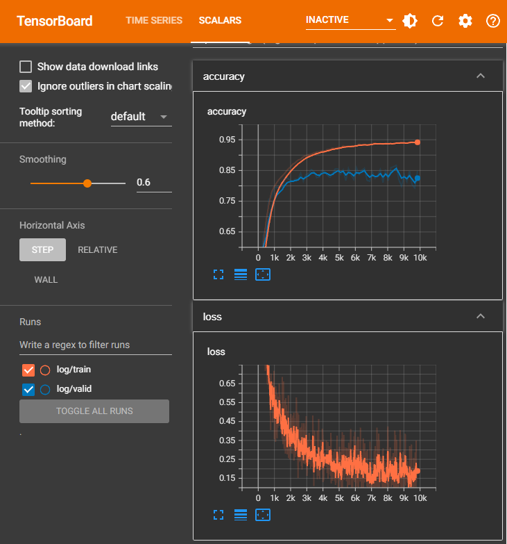
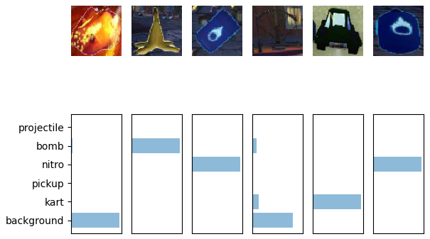

# Introduction
Train a Convolutional network to classify images from SuperTuxKart.

# Dataset
Download the dataset and unzip it using the following code:

```python
!wget https://www.cs.utexas.edu/~philkr/supertux_classification_trainval.zip
!wget https://www.cs.utexas.edu/~philkr/supertux_segmentation_trainval.zip

!unzip -q supertux_classification_trainval.zip
!unzip -q supertux_segmentation_trainval.zip
```

# Output
Loss and Accuracy during training:



Visualize the model's prediction:
```python
!python3 -m viz_prediction [DATASET_PATH]
```

