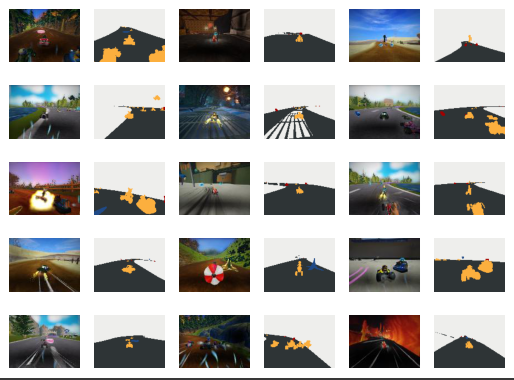
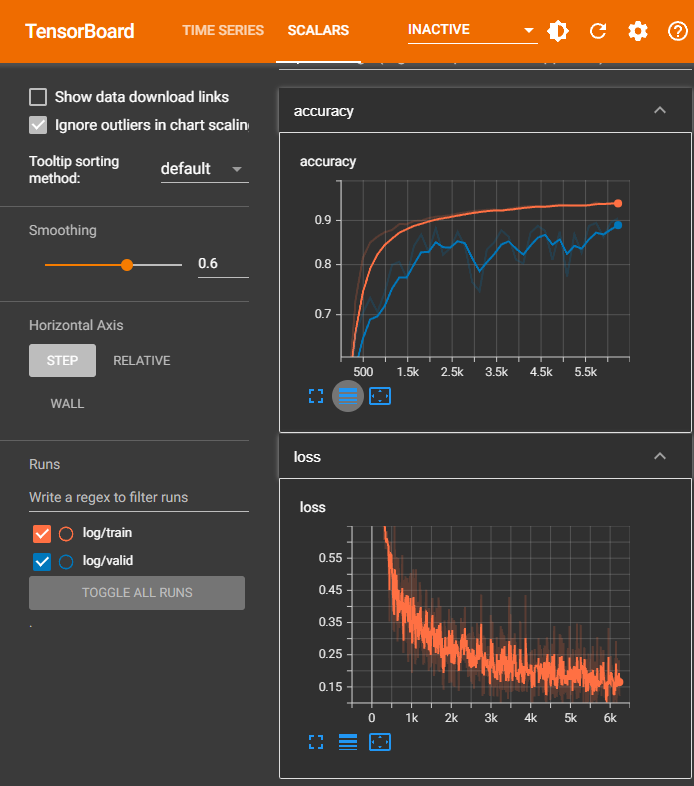
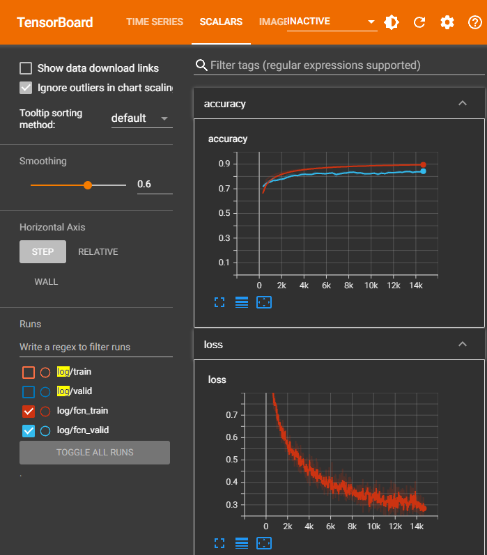
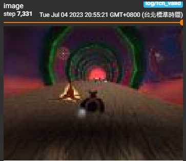
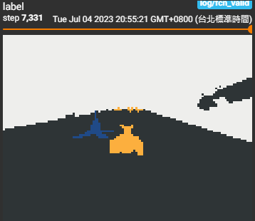
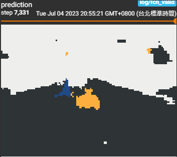

# Introduction
Improving the Convolutional model for classifying images from SuperTuxKart by trying with:
- Input normalization
- Residual blocks
- Dropout
- Data augmentations (Both geometric and color augmentations)
- Weight regularization
- Early stopping
  
Besides, Train a Fully Convolutional network to classify images from SuperTuxKart.

# Dataset
Download the dataset and unzip it using the following code:

```python
!wget https://www.cs.utexas.edu/~philkr/supertux_classification_trainval.zip
!wget https://www.cs.utexas.edu/~philkr/supertux_segmentation_trainval.zip

!unzip -q supertux_classification_trainval.zip
!unzip -q supertux_segmentation_trainval.zip
```

Visualize the dense dataset:
```python
%run -m utils
```


# Training
Loss and Accuracy during training (CNN):



Loss and Accuracy during training (FCN):



# Output
Original image:



Image label:



Image label predict:


