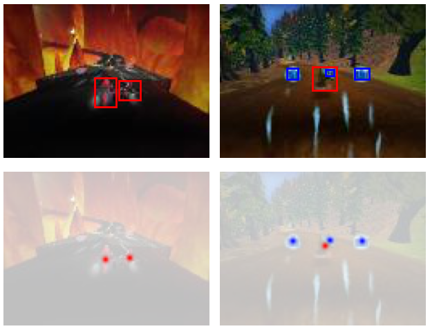
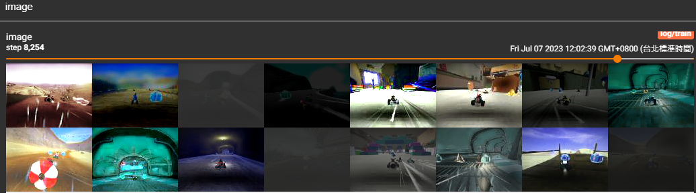

# Introduction
Implementing a point-based object detection (FCN) that will predict a dense heatmap of object centers. 
Each "peak" (local maxima) in the heatmap corresponds to a detected object.

# Dataset
Download the dataset and unzip it using the following code:

```python
!wget https://www.cs.utexas.edu/~philkr/supertux_classification_trainval.zip
!wget https://www.cs.utexas.edu/~philkr/supertux_segmentation_trainval.zip

!unzip -q supertux_classification_trainval.zip
!unzip -q supertux_segmentation_trainval.zip
```
The "ToHeatmap" transform changes the label of the image to the following:



# Output
Red = Kart, Green = Bomb, Blue = pickup item

Original image:


True label:


Object detect prediction:

