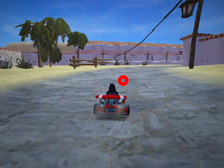

# Introduction
This is a vision-based driving agent in SuperTuxKart.

# Collecting Data
Designing a controller that acts as an auto-pilot to drive in SuperTuxKart, then use this auto-pilot to train a vision-based driving system.

Use the following code to install SuperTuxKart:
```python
%pip install -U PySuperTuxKart
```

Gathering the images that aim point on the center of the track 15 meters away from the kart, as shown below.



Collecting data from 6 tracks. 
Zen garden, Lighthouse, Hacienda, Snowtuxpeak, Cornfield crossing and Scotland.

### Controller
These of the hyper-parameters of the controller.
pystk.Action.steer: the steering angle of the kart normalized to -1 ... 1
pystk.Action.acceleration: the acceleration of the kart normalized to 0 ... 1
pystk.Action.brake: a boolean indicator for braking
pystk.Action.drift: a special action that makes the kart drift, useful for tight turns
pystk.Action.nitro: burns nitro for fast acceleration

This is what it looks like:

https://github.com/wilson19971205/Computer-Vision-Projects/assets/43212302/fb92092b-e3c2-4bdb-b698-1fe2ce08975f


